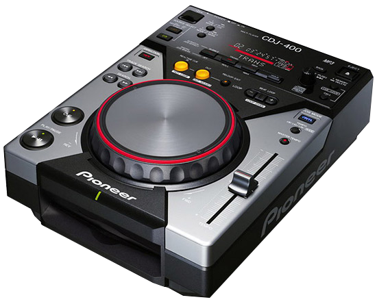

# CDJ 400 Track Formatter



This project contains a ruby script used to format a collection of songs, makig it easier to traverse the collection when loaded onto a Pioneer CDJ 400. This repository is a work-in-progress.

## The Problem

Pioneer CDJ 400s organize and display tracks by their full filename, based on the track's metadata. The format for this is `track_number song_title` (example: "02 Beachy Head.mp3") which isn't very helpful. I found it difficult to find tracks with this formatting, having to scroll through all the 01s, then the 02s, etc. Furthermore, some artists have tracks which are not uniquely named - this proposes an even more annoying scenario.

## The solution

Create a formatting script that will organize each file within an artist's directory (example: "Throbbing Gristle/Beachy Head.mp3") which would allow me to search tracks by artists alphabetically, then drill down into the songs available for that artist.

## Usage

Download this project and collect it's dependencies

```shell
git clone https://github.com/seanpierce/CDJ-400-Track-Formatter
cd CDJ-400-Track-Formatter && bundle install
```

Navigate into the directory containing your files and run the script

```shell
cd ~/path/to/tracks
ruby ~/path/to/CDJ-400-Track-Formatter/app.rb
```

This application will rename and move your files permanently. It's best to copy your original files into another directory before running this script. Exercise caution. The application **will not** overwrite the original metadata on the track - there will be no visible changes when reimporting the formatted tracks back into iTunes.

[Please visit the wiki](https://github.com/seanpierce/CDJ-400-Track-Formatter/wiki) for a more detailed outline of the funcitonalities of this script, including future features.

## License
MIT, use at your own risk